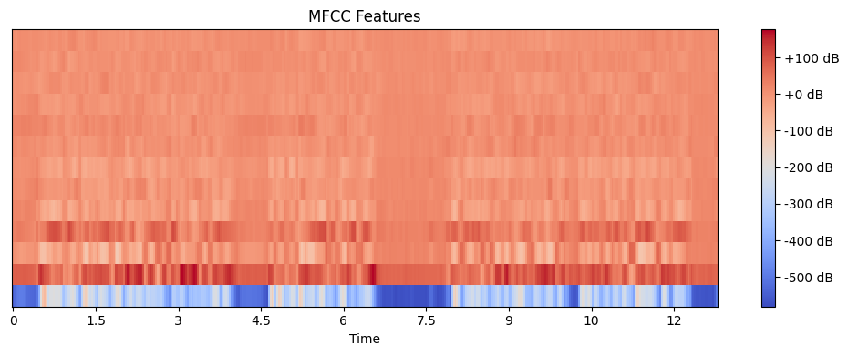
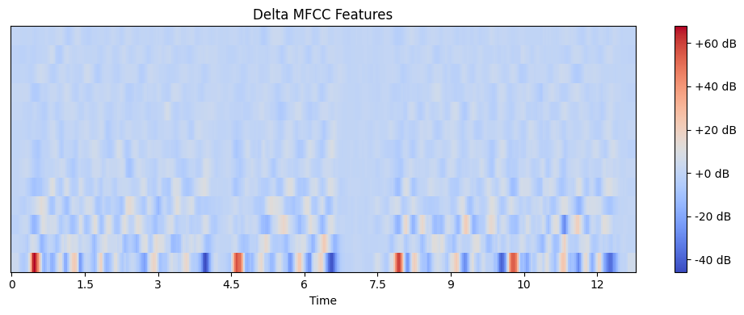
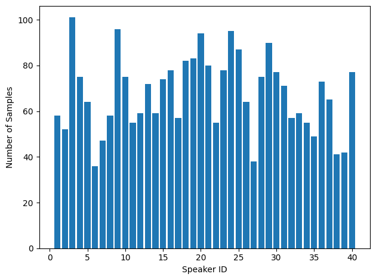
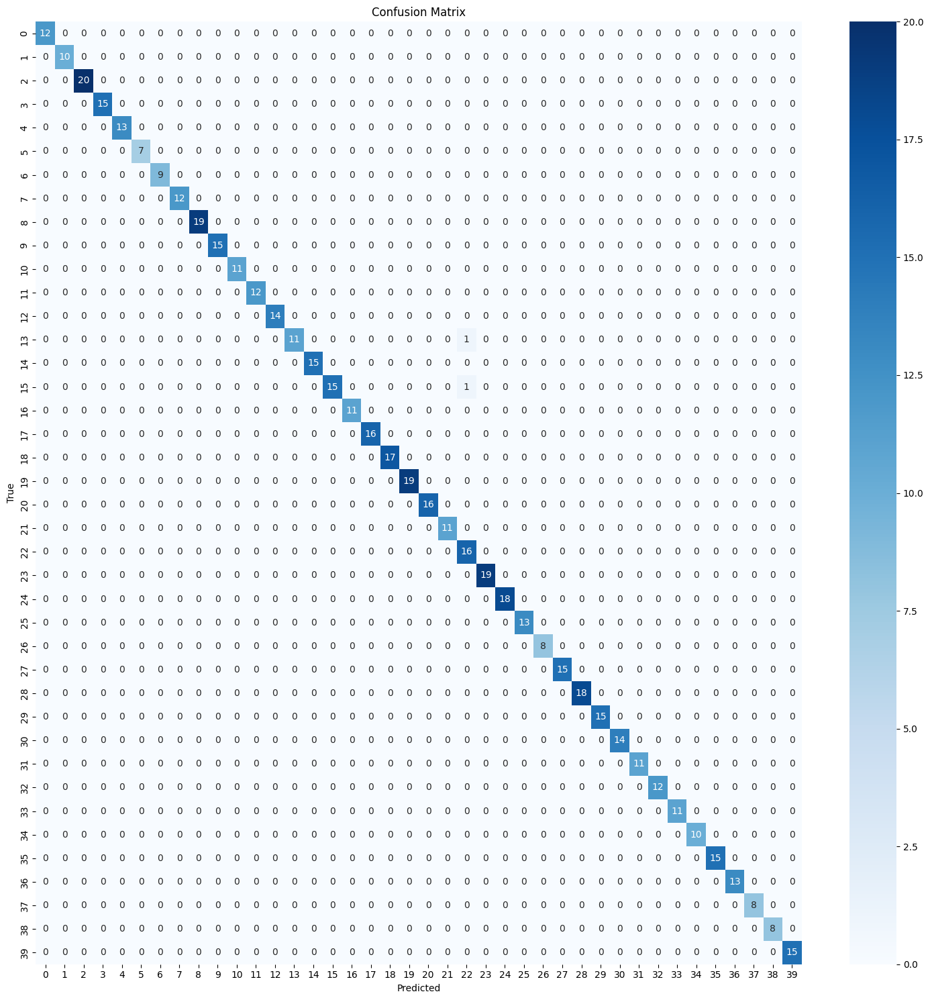
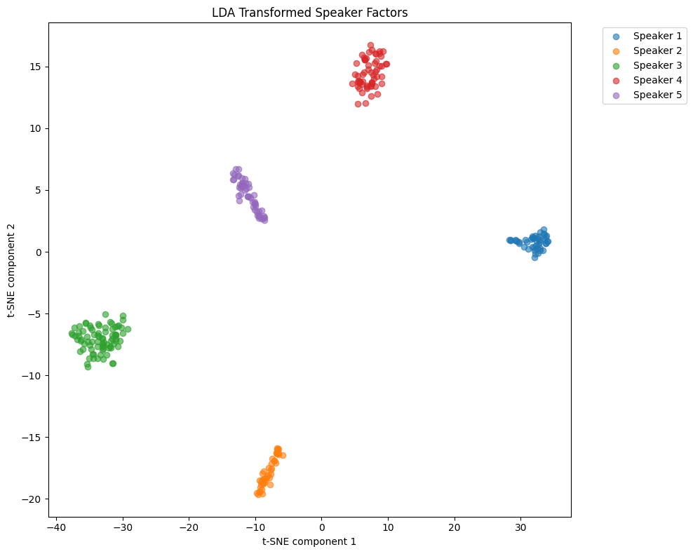

# Speaker Identity Verification Using I-Vectors

A state-of-the-art speaker identification system achieving **99.63% accuracy** using advanced signal processing and machine learning techniques. This implementation follows the classical speaker recognition pipeline with Universal Background Models (UBM), supervector adaptation, and factor analysis.

## Overview

This project implements a robust speaker recognition system that can identify speakers from audio recordings. The system uses a multi-stage pipeline involving feature extraction, statistical modeling, and machine learning to create distinctive speaker embeddings.

## Methodology

### 1. Feature Extraction

- **MFCC (Mel-Frequency Cepstral Coefficients)**: Extracts 13 MFCC coefficients that capture the spectral characteristics of speech
- **Delta MFCC**: Computes temporal derivatives to capture dynamic speech features
- **Combined Features**: Concatenates MFCC and Delta-MFCC for a 26-dimensional feature vector

_Figure 1: MFCC feature extraction showing spectral characteristics over time_

_Figure 2: Delta MFCC features capturing temporal dynamics of speech_

### 2. Universal Background Model (UBM)

- Trains a **64-component Gaussian Mixture Model** on all speaker data
- Each Gaussian component models different speech characteristics (vowels, consonants, silence, etc.)
- Serves as a universal speaker-independent model for adaptation

### 3. Supervector Creation

- **GMM Adaptation**: Adapts UBM means for each speaker using Maximum A Posteriori (MAP) adaptation
- **Relevance Factor**: Controls the balance between speaker-specific and universal model data (α = 16.0)
- **Supervector**: Flattens adapted GMM means into a high-dimensional vector (64 × 26 = 1,664 dimensions)

### 4. Factor Analysis

- Reduces supervector dimensionality from 1,664 to **200 components**
- Removes unwanted variability (microphone differences, environmental conditions, session variations)
- Focuses on speaker-discriminative information

### 5. Linear Discriminant Analysis (LDA)

- Further reduces dimensionality while maximizing between-class separability
- Transforms features to a space where speakers are maximally separated

### 6. Within-Class Covariance Normalization (WCCN)

- Normalizes within-class covariance to identity matrix
- Makes cosine similarity more reliable for speaker comparison
- Reduces residual variability unrelated to speaker identity

### 7. Speaker Identification

- **Enrollment**: Creates speaker embeddings by averaging training samples
- **Testing**: Computes cosine similarity between test embeddings and enrolled speakers
- **Decision**: Selects speaker with highest similarity score

## Results

- **Dataset**: 40 speakers with multiple audio samples each
- **Train/Test Split**: 80/20 stratified split
- **Accuracy**: **99.63%** on test set
- **Features**: Excellent speaker separability as visualized through t-SNE plots

_Figure 3: Distribution of audio samples across 40 speakers in the dataset_

## Performance Analysis

### Confusion Matrix

The system shows excellent performance with minimal confusion between speakers. The 99.63% accuracy indicates:

- Strong discriminative features
- Effective noise reduction through factor analysis
- Robust normalization techniques

_Figure 4: Confusion matrix showing 99.63% accuracy with minimal speaker misclassification_

### Visualization

- **t-SNE plots** demonstrate clear speaker clustering in the transformed space
- **Feature visualization** shows distinct MFCC and Delta-MFCC patterns
- **Speaker distribution** shows balanced dataset across all 40 speakers

_Figure 5: t-SNE visualization of LDA-transformed speaker factors showing clear speaker clustering_

## References

- Reynolds, D. A., et al. "Speaker verification using adapted Gaussian mixture models." Digital signal processing (2000)
- Campbell, W. M., et al. "Support vector machines for speaker and language recognition." Computer Speech & Language (2006)
- Dehak, N., et al. "Front-end factor analysis for speaker verification." IEEE Transactions on Audio, Speech, and Language Processing (2010)
